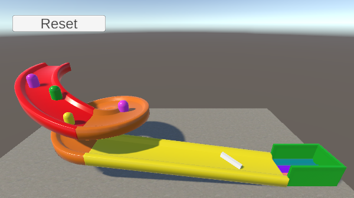

## Colours and Collisions

**Unity** is a game engine that you can use to create video games and 3D experiences. If you have been through the [Intro to Unity pathway]() you might be wondering what else there is to explore. 

In this project you are going to explore two key components; `Rigidbodies` and `Materials` and how you can use them to bring your Unity projects. 

### What you will do

In this Discover project you are going to play with some Unity projects that make use of these two components. These examples will show you what you can do with the components. 

If you enjoy this then you can jump straight into our [More Unity pathway]() where you will put these components to use to create your own experience. 

### Physics and Rigidbodies

One of the benefits of a 3D game engine is that the software can simulate **Physics** - a big part of Physics is controlling what happens when objects collide. 

The component you can use to control this is a `Rigidbody` - using one means Unity will apply forces to the object such as gravity and friction. 

You can combine Rigidbodies with `Physic Materials` to completely control the way the Physics of your game work. 

--- no-print ---
Use the <kbd>WASD</kbd> keys to roll the marble and you can hold the left mouse button to rotate the camera. 

Roll the marble down the ramps and bounce it off of the capsules at the bottom. 

To get back to the top you can click the "Reset" button at the top.

The marble is using a Rigidbody. The ramps and capsules have different Physic Materials applied to them. 

+ Can you tell which ramp has the least amount of Friction?
+ Which capsule is the bounciest?

  <iframe allowtransparency="true" width="710" height="500" src="https://raspberrypilearning.github.io/unity-webgl/MaterialDemo/" scrolling="no" frameborder="0"></iframe>

--- /no-print ---

--- print-only ---

--- /print-only ---

--- collapse ---
---
title: What you will need
---
### Hardware

+ A computer or tablet capable of running Scratch 3

### Software

+ Scratch 3 (either [online](https://scratch.mit.edu/){:target="_blank"} or [offline](https://scratch.mit.edu/download){:target="_blank"})
+ Python 3
+ This project can be completed in a web browser using [trinket.io](https://trinket.io/)

### Downloads

+ Download the project [starter file](https://rpf.io/p/en/projectName-go){:target="_blank"} if working offline

--- /collapse ---

--- collapse ---
---
title: What you will learn
---

+ Learning objective 1
+ Learning objective 2
+ Learning objective 3

--- /collapse ---

--- collapse ---
---
title: Additional information for educators
---

You can download the completed project [here](https://rpf.io/p/en/projectName-get){:target="_blank"}.

If you need to print this project, please use the [printer-friendly version](https://projects.raspberrypi.org/en/projects/projectName/print){:target="_blank"}.

--- /collapse ---
