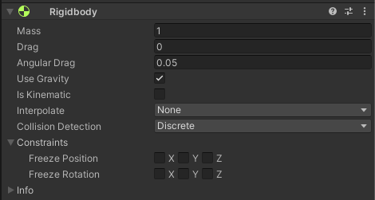
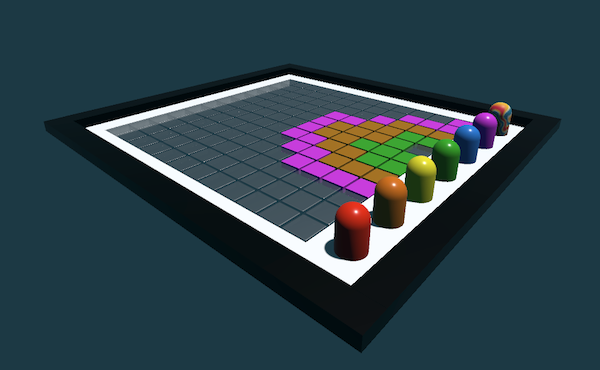

## Colours and Collisions

**Unity** is a game engine that you can use to create video games and 3D experiences. If you have been through the [Intro to Unity pathway]() you might be wondering what else there is to explore. 

In this project you are going to explore two key components; `Rigidbodies` and `Materials` and how you can use them to bring your Unity projects. 

### What you will do

In this Discover project you are going to play with some Unity projects that make use of these two components. These examples will show you what you can do with the components. 

If you enjoy this then you can jump straight into our [More Unity pathway]() where you will put these components to use to create your own experience. 

### Physics and Rigidbodies

One of the benefits of a 3D game engine is that the software can simulate **Physics**. 

One of the components you can use to do this is a `Rigidbody` - which Unity uses to apply forces to an object such as gravity and friction. 

You can combine a `Rigidbody` with `Physic Materials` to change the ways forces act on the objects in your projects. 

--- no-print ---
Use the <kbd>WASD</kbd> keys to roll the marble and you can hold the left mouse button to rotate the camera. 

Roll the marble down the ramps and bounce it off of the capsules at the bottom. 

To get back to the top you can click the "Reset" button at the top.

The marble is using a Rigidbody. The ramps and capsules have different Physic Materials applied to them. 

+ Can you tell which ramp has the least amount of Friction?
+ Which capsule is the bounciest?

<iframe allowtransparency="true" width="710" height="500" src="https://raspberrypilearning.github.io/unity-webgl/PhysicsDemo/" scrolling="no" frameborder="0"></iframe>

--- /no-print ---

--- print-only ---

--- /print-only ---

--- collapse ---

---
title: The Rigidbody component
---

When you add a `Rigidbody` to a GameObject you can use the **Inspector** to change the ways forces will affect the object. 

+ Mass - like in the real world this will change how much force is needed to push an object and the amount of friction will affect the objects speed
+ Drag/Angular drag - this works like air resistance, how quickly an object will reduce it's speed or rotation
+ Use Gravity - this will set whether the Rigidbody is pulled down by the in game force of gravity.
+ Is Kinematic - if an object is kinematic it means that all forces applied to it are controlled through code and will not be affected by other objects in the Scene
+ Interpolate - helps smooth the movement of an object
+ Collision detection - changes the precision and number of checks performed to see if the object is colliding with any other objects

--- /collapse ---

--- collapse ---

---
title: Physic Materials
---

You apply a `Physic Material` to a collider to change the way it affects other objects it collides with. 

Physics Materials have three attributes that you can set to any value between `0` and `1` to change an objects interactions: 
**Dynamic Friction:** How quickly an object that is already moving will slow down. `0` is like ice (not very much friction) and `1` would stop a moving object very quickly. 
**Static Friction:** The amount of force needed to move an object from standing still. `0` means any amount of force is needed and `1` would require a huge amount of force to move an object. 
**Bounciness:** How bouncy an object is. `0` is no bounce at all and `1` means an object will bounce and not lose any velocity.

--- /collapse ---

### Materials and colours

Changing the way an object looks is an important part of designing any game or interactive experience. If a game looks interesting or engaging players will be immersed in the experience more fully.

The main way you change the way objects look in Unity is by using a `Material` to add colour and the appearance of texture. 

--- no-print ---
Use the <kbd>WASD</kbd> keys to roll the marble and you can hold the left mouse button to rotate the camera. 

The capsules will change the colour of the marble, you can then colour in the tiled floor using those colours.

The multicoloured capsule on the left hand side will give the marble a random colour.

All of these colours are made using different `Materials`, which you can control through code.

+ Play the game and try to colour in every part of the tiled floor

<iframe allowtransparency="true" width="710" height="500" src="https://raspberrypilearning.github.io/unity-webgl/MaterialDemo/" scrolling="no" frameborder="0"></iframe>

--- /no-print ---

--- print-only ---

--- /print-only ---

--- collapse ---

---
title: Changing Materials with code
---

There are a number of ways you can control how objects look with code. 

You can:
+ Transfer the colour from one object to another
+ Assign a random colour to an object
+ Change from one material to another

All of these rely on the Physics mentioned above, to detect collisions between objects and to know when to change a Material or colour.

--- /collapse ---

### Putting it all together

Combining the use of Physics and Materials will allow you to create truly engaging Unity projects, and this is the focus of the [More Unity pathway](https://projects.raspberrypi.org/en/pathways/more-unity){:target="_blank"}.

Here is an example from the first project in the More Unity path, [Rainbow Run](https://projects.raspberrypi.org/en/projects/rainbow-run){:target="_blank"}.

--- no-print ---

Control the camera by clicking the left mouse button and moving the mouse. Control the movement of the ball using <kbd>WASD</kbd> (or <kbd>ZQSD</kbd>) or the arrow keys. 

+ Which objects do you think use a `Rigidbody` in this game?
+ How have materials been used to make the game more engaging?

<iframe allowtransparency="true" width="710" height="500" src="https://rainbow-run.rpfilt.repl.co/" scrolling="no" frameborder="0"></iframe>

--- /no-print ---

--- print-only ---

--- /print-only ---

### What next?

If you want to learn more about Rigidbodies, Physics Materials and Materials you should start the [More Unity pathway](https://projects.raspberrypi.org/en/pathways/more-unity){:target="_blank"}.

There are 6 projects for you to complete which will help you gain the skills you need to create engaging 3D experiences!